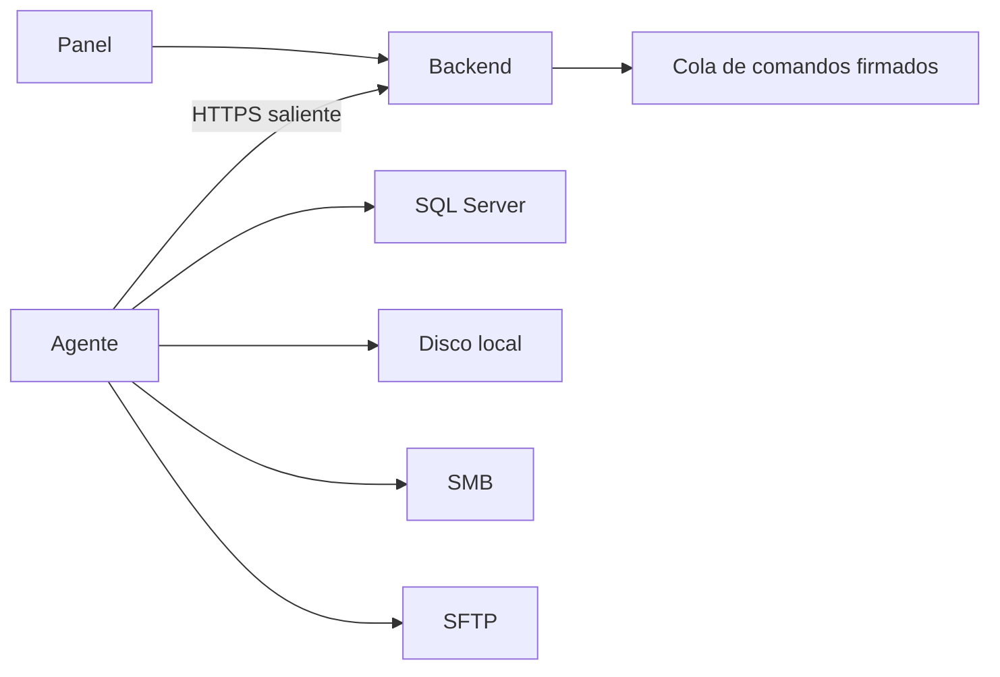

# Data Express Agent 0.5.0

- Fecha de preparación: 26 de agosto de 2026
- Rama de entrega: `main`
- Base revisada: `eca5340` y correcciones de endurecimiento de la entrega 0.5.0

## Índice

1. [Estado de la entrega](#1-estado-de-la-entrega)
2. [Resumen ejecutivo](#2-resumen-ejecutivo)
3. [Contenido del paquete](#3-contenido-del-paquete)
4. [Requisitos](#4-requisitos)
5. [Instalación](#5-instalación)
6. [Actualización y rollback](#6-actualización-y-rollback)
7. [Arquitectura](#7-arquitectura)
8. [Perfiles administrados](#8-perfiles-administrados)
9. [Backup SQL](#9-backup-sql)
10. [Bases grandes](#10-bases-grandes)
11. [Estructura de entrega](#11-estructura-de-entrega)
12. [Limpieza y recuperación](#12-limpieza-y-recuperación)
13. [Backup de archivos](#13-backup-de-archivos)
14. [Reemplazo de agentes](#14-reemplazo-de-agentes)
15. [Seguridad](#15-seguridad)
16. [Diagnóstico](#16-diagnóstico)
17. [Pruebas](#17-pruebas)
18. [Decisiones](#18-decisiones)
19. [Limitaciones](#19-limitaciones)
20. [Referencia rápida](#20-referencia-rápida)

## 1. Estado de la entrega

| Área | Estado | Observación |
| --- | --- | --- |
| Vinculación, firma y comunicación HTTPS | Disponible | Comunicación saliente y comandos Ed25519 |
| Heartbeat independiente | Disponible | Supervisor separado, intervalo predeterminado de 30 segundos |
| Backup SQL Full, diferencial y log | Disponible | Validación con SQL Server antes de reportar éxito |
| Destinos local, SMB y SFTP para SQL | Disponible | SFTP requiere huella de host explícita |
| Backup SQL directo a SMB | Piloto | Requiere prueba de restauración con datos representativos |
| Exploración y limpieza estructural | Disponible | Simulación y controles de ruta obligatorios |
| Backup de archivos local y SMB | Piloto | Full, incremental y diferencial con catálogo SQLite |
| Restauración de archivos | Pendiente | No debe ofrecerse como función terminada |
| VSS, retención y SFTP de archivos | Pendiente | Fuera del alcance operativo de esta entrega |

Las funciones marcadas como piloto deben habilitarse primero en un servidor controlado.

## 2. Resumen ejecutivo

La versión 0.5.0 sustituye la configuración manual del agente 0.4.2 por vinculación
temporal, perfiles administrados y una cola de comandos firmados. Agrega telemetría de
discos, backup SQL directo para grandes volúmenes, reintentos durables, limpieza
estructural y el primer motor de backup de archivos.

El instalador valida la integridad SHA-256 antes de modificar el servidor, confirma el
heartbeat antes de declarar éxito y evita sobrescribir accidentalmente una instalación
existente. El actualizador conserva identidad y datos operativos y detiene la versión
nueva antes de restaurar binarios anteriores.

## 3. Contenido del paquete

- `Instalar-DataExpressAgent.cmd`: entrada recomendada para instalaciones nuevas.
- `DataExpressAgent/DataExpressAgent.exe`: agente autocontenido; no se abre manualmente.
- `DataExpressAgent.Service.exe`: WinSW 2.12.0.
- `bootstrap.json`: URL pública, versión e identidad de las claves de confianza.
- `VERSION.txt`: versión de la entrega.
- `SHA256SUMS.txt`: hash de cada archivo del paquete excepto el propio manifiesto.
- `CAMBIOS-AGENTE-0.5.0.md`: este manual.
- `installer/Install-DataExpressAgent.ps1`: instalación nueva.
- `installer/Update-DataExpressAgent.ps1`: actualización conservadora.
- `installer/Test-InstallPrerequisites.ps1`: diagnóstico previo sin cambios.
- `installer/Smoke-TestRelease.ps1`: validación local de la entrega.
- `installer/Uninstall-DataExpressAgent.ps1`: retiro del servicio.

## 4. Requisitos

- Windows de 64 bits y PowerShell 5.1 o posterior.
- Permisos administrativos para instalar el servicio.
- Acceso HTTPS saliente al plano de control.
- Hora del servidor sincronizada.
- Código de vinculación vigente generado desde el panel.
- Cuenta del servicio con permisos SQL y de almacenamiento necesarios.
- Espacio suficiente más la reserva crítica configurada.

El servicio usa `NT AUTHORITY\NetworkService`. En un dominio, los permisos SMB se
conceden normalmente a `DOMINIO\SERVIDOR$`. La cuenta del motor SQL Server también debe
poder escribir en la ruta donde SQL crea el archivo nativo.

## 5. Instalación

1. Extraiga el ZIP completo.
2. Ejecute `installer\Test-InstallPrerequisites.ps1` si desea un diagnóstico previo.
3. Abra `Instalar-DataExpressAgent.cmd`.
4. Acepte UAC y pegue el código temporal.
5. Espere la confirmación de vinculación.
6. Compruebe `Get-Service DataExpressAgent` y la presencia del agente en el panel.

El bypass de ExecutionPolicy se aplica solamente al proceso de instalación. Si el
servicio ya existe, el instalador se detiene y exige utilizar el actualizador.

Ubicaciones predeterminadas:

- Programa: `C:\Program Files\Data Express\Agent`
- Datos: `C:\ProgramData\DataExpress\Agent`
- Servicio: `DataExpressAgent`

## 6. Actualización y rollback

Desde PowerShell administrativo dentro de `installer`:

```powershell
.\Update-DataExpressAgent.ps1
```

El proceso valida hashes, respalda `agent.json`, conserva identidad, secretos DPAPI,
catálogo y journal, espera la detención, reemplaza el bundle y exige un heartbeat nuevo.
Si la confirmación no llega en 90 segundos, detiene el agente nuevo, restaura binarios y
configuración y vuelve a iniciar la versión anterior.
Las instalaciones heredadas bajo `LocalService` migran a `NetworkService`. Las cuentas
de servicio personalizadas se conservan y un rollback restaura la cuenta anterior.

## 7. Arquitectura



No existe un comando de shell genérico. El agente acepta únicamente tipos incluidos en
su allowlist y verifica la firma del backend antes de ejecutarlos. Heartbeat y operación
se ejecutan en hilos separados.

## 8. Perfiles administrados

Los perfiles SQL y de destino se administran desde el panel. La configuración pública y
los secretos se entregan al agente en un sobre cifrado dirigido a su identidad. Los
secretos locales se protegen con DPAPI y no regresan al backend.

La migración desde 0.4.2 acepta perfiles públicos heredados. Contraseñas y cadenas de
conexión no se aceptan dentro del archivo de migración.

## 9. Backup SQL

Flujo tradicional:

1. Comprobar perfil, destino y espacio.
2. Ejecutar `BACKUP DATABASE` o `BACKUP LOG`.
3. Esperar el archivo terminado.
4. Ejecutar `RESTORE VERIFYONLY`.
5. Crear y validar el ZIP.
6. Transferir y verificar tamaño o huella según el destino.
7. Registrar resultado y limpiar temporales en segundo plano.

Se admiten Full, diferencial y log. Diferencial y log dependen de una cadena de backups
válida en SQL Server.

## 10. Bases grandes

Para perfiles habilitados, el modo directo ordena a SQL Server escribir un `.bak`
comprimido directamente en SMB. No crea ZIP ni duplica el archivo en el disco local. El
archivo se crea con nombre temporal, se valida y se publica con nombre final sin
sobrescribir artefactos existentes.

Antes de usarlo con una base cercana a 1 TB se debe probar acceso UNC con la cuenta de
SQL Server, medir duración y crecimiento, comprobar la reserva de espacio y restaurar
una copia en un entorno aislado.

## 11. Estructura de entrega

Los ZIP SQL contienen nombres legibles, un manifiesto y hashes de los archivos nativos.
Los nombres visibles evitan identificadores técnicos cuando la carpeta de trabajo ya
garantiza aislamiento. El modo directo produce un único `.bak` validado.

## 12. Limpieza y recuperación

La limpieza estructural exige raíz absoluta, nombres permitidos, simulación vigente y
límites de cantidad y bytes. Los archivos que cambian después de la simulación se
omiten. La cuarentena permite restaurar o purgar según permisos; el modo directo queda
registrado como operación destructiva y no se reanuda automáticamente.

Los `.bak` temporales se conservan si falla la compresión o transferencia. Una marca
durable permite reintentar la limpieza posterior sin convertir un backup válido en
fallido.

## 13. Backup de archivos

El motor piloto incluye:

- simulación con filtros;
- Full, incremental y diferencial;
- copia directa local o SMB;
- SHA-256, manifiestos y catálogo SQLite;
- checkpoints y continuación de una ejecución interrumpida;
- prueba de destino y prevención de sobrescritura.

Restauración, cancelación inmediata, VSS, retención automática, ZIP64 y SFTP para este
módulo permanecen pendientes.

## 14. Reemplazo de agentes

El backend incluye reemplazo confirmado en dos fases. El agente candidato debe vincular,
reportar salud y recibir confirmación antes de heredar configuración pública, tareas y
programaciones. Los secretos vinculados al equipo anterior deben capturarse nuevamente.

## 15. Seguridad

- El ZIP no contiene contraseñas, llaves privadas ni códigos de vinculación.
- TLS se verifica con el almacén de certificados incluido.
- Solicitudes y comandos usan Ed25519, timestamp y nonce.
- Las huellas SFTP se aprueban explícitamente.
- El servicio utiliza una cuenta integrada de privilegio reducido.
- El instalador comprueba todos los hashes antes de escribir en Program Files.
- Los directorios de programa y datos reciben ACL restringidas.

`SHA256SUMS.txt` detecta corrupción y cambios accidentales. La firma Authenticode del
ejecutable requiere un certificado de publicación corporativo y se gestiona fuera de
este repositorio.

## 16. Diagnóstico

```powershell
Get-Service DataExpressAgent
Get-ChildItem "C:\Program Files\Data Express\Agent\DataExpressAgent.Service*.log"
.\installer\Smoke-TestRelease.ps1
```

- Sin heartbeat: compruebe HTTPS, hora, código, URL y logs.
- Error SQL: valide permisos de `NetworkService` y de la cuenta del motor SQL.
- SMB denegado: valide permisos de recurso compartido y NTFS para la cuenta de máquina.
- Falta de espacio: reduzca el lote, cambie destino o ajuste una reserva aprobada.
- SFTP: confirme host, puerto, llave local y huella del servidor.

## 17. Pruebas

La fuente mantiene pruebas unitarias para protocolo, identidad, perfiles, almacenamiento,
backup SQL, modo directo, backup de archivos, limpieza, journal, exploración, heartbeat e
instaladores. La generación de release ejecuta las pruebas del agente antes de compilar.

La salida a producción requiere además instalación y actualización en una VM limpia,
backup y restauración SQL reales, desconexión durante una operación y un piloto de gran
volumen.

## 18. Decisiones

- Un único `.cmd` inicia instalaciones nuevas.
- Las instalaciones existentes solo se modifican con el actualizador.
- El código temporal nunca se guarda en `agent.json`.
- El heartbeat no depende del ejecutor de backups.
- Un backup no se reporta listo antes de su validación.
- La limpieza posterior es independiente y reintentable.
- El rollback detiene primero los binarios que va a reemplazar.

## 19. Limitaciones

| Limitación | Impacto | Acción recomendada |
| --- | --- | --- |
| Backup directo sin piloto de 1 TB | Riesgo de duración o permisos no conocidos | Piloto y restauración aislada |
| Backup de archivos en fase piloto | Operación incompleta frente al diseño total | Limitar a local/SMB controlado |
| Sin VSS para archivos abiertos | Copia potencialmente inconsistente | Excluir archivos activos críticos |
| Sin restauración de archivos desde el panel | Recuperación manual | Documentar procedimiento operativo |
| Sin firma Authenticode corporativa | Advertencias de reputación de Windows | Firmar en la canalización oficial |

## 20. Referencia rápida

```powershell
# Diagnóstico
.\installer\Test-InstallPrerequisites.ps1

# Instalación manual
.\installer\Install-DataExpressAgent.ps1

# Actualización
.\installer\Update-DataExpressAgent.ps1

# Estado
Get-Service DataExpressAgent

# Verificación del paquete
.\installer\Smoke-TestRelease.ps1
```

Lista posterior a instalación: servicio en ejecución, heartbeat visible, versión 0.5.0,
volúmenes reportados, perfil probado y operación pequeña validada. Antes de gran volumen:
confirmar permisos SQL/SMB, espacio, reserva, ventana operativa y destino de restauración.
